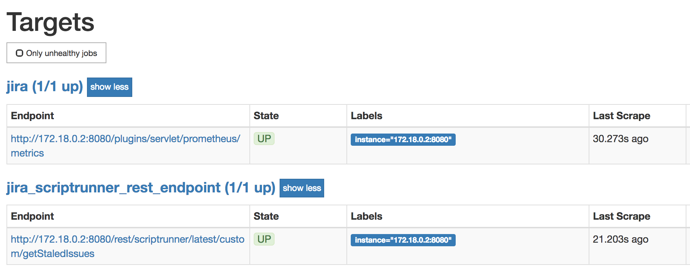

# atlassian-metrics

The below steps will take us through some basic proof of concept to scrap data or metrics from Atlassian Jira in two different ways. We need to figure out how we want to visualize certain data or metrics and then design them accordingly.

We will describe how we get data or metrics from Atlassian Jira and visualize them in Prometheus and Grafana.

## Plugins

* [Prometheus Exporter For Jira](https://marketplace.atlassian.com/apps/1217960/prometheus-exporter-for-jira?hosting=server&tab=overview)

It expose some key metrics on a REST endpoint. Most of the metrics are of operational interest.

* [ScriptRunner for Jira](https://marketplace.atlassian.com/apps/6820/scriptrunner-for-jira?hosting=server&tab=overview)

## Components

* Atlassian Jira, our source of data or metrics being exported for Prometheus.
* [Prometheus](https://prometheus.io/), the monitoring system and time series database to persist our data.
* [Grafana](https://grafana.com/), the pen platform for beautiful analytics and monitoring to help us do graphing on the Prometheus data.

### Steps

* Get Atlassian Jira up and running with the below two add-ons.
  * [Prometheus Exporter For Jira](https://marketplace.atlassian.com/apps/1217960/prometheus-exporter-for-jira?hosting=server&tab=overview)
  * [ScriptRunner for Jira](https://marketplace.atlassian.com/apps/6820/scriptrunner-for-jira?hosting=server&tab=overview)
* Configure ScriptRunner.
  * Expose the custom REST endpoint by using [get_jira_issues_rest_endpoint.groovy](get_jira_issues_rest_endpoint.groovy) file.
* Get Prometheus running using Docker.
* Get Grafana running using Docker.
  * Configure visualization of graphs in Grafana.

## Jira using Atlassian Team in Space

Praqma is a partner with Atlassian. We have been given access to their Teams In Space demonstration environment, which is a solution with all their applications integrated and with mocked data included. We containerized it ourselves for demonstration purpose, but are not allowed to make it public any of it public.

_Unfortunately, if you're not Praqma folks, you will have to use your own Atlassian Jira instance and install the add-ons. Also, adjust the URL and configuration as required below._

* Start Jira from our Teams In Space container, using the adjusted image that includes the related add-ons.

Expect some time for Jira to start up properly. Check the progress of starting Jira under this [page](http://jira.teamsinspace.com:8080).

```bash

docker run \
--name teams_in_space \
--detach \
--interactive \
--tty \
--publish 2430:2430 \
--publish 7990:7990 \
--publish 8060:8060 \
--publish 8080:8080 \
--publish 8085:8085 \
--publish 8090:8090 \
praqma/tis:use-prometheus-plugin \
start-jira.sh

```

* Log into JIRA (credentials for admin can be found in our [Teams in Space project](https://github.com/Praqma/tis)) and do a `Re-Index` under `Jira Administration -> System -> Advanced -> Indexing`. [Direct link](http://jira.teamsinspace.com:8080/secure/admin/jira/IndexAdmin.jspa).

* After indexing completed, check if the JQL query is working properly: `http://jira.teamsinspace.com:8080/issues/?jql=(project%20%3D%20TIS%20and%20assignee%20!%3D%20currentUser()%20and%20updated%20<%3D%20-7d%20and%20resolution%20is%20EMPTY)`

JQL results should return `89` issues.

## JQL and ScriptRunner

We can serve customized JQL results on a REST endpoint as well. We must make the exported data or metrics compatible for Prometheus.

We can use the similar JQL in [get_jira_issues_rest_endpoint.groovy](get_jira_issues_rest_endpoint.groovy) file for ScriptRunner.

* Open Script Console page, under `Jira Administration -> Add-ons, left menu chose Script Console under Scriptrunner`: [Direct link ](http://jira.teamsinspace.com:8080/plugins/servlet/scriptrunner/admin/console).

* Paste the content of [get_jira_issues_rest_endpoint.groovy](get_jira_issues_rest_endpoint.groovy) file into the console. Remember to click the `Run` button at the bottom of the console.

* After `Run`, click on the `Logs` tab, you should get a similar output as below.

`2018-06-01 07:52:34,516 DEBUG [runner.ScriptRunnerImpl]: Total issues: 89`

### REST Endpoint

* Use the authenticated browser session to browse below link.

`http://jira.teamsinspace.com:8080/rest/scriptrunner/latest/custom/getStaledIssues`

* Use a terminal to use the below command.

`curl -u username:password http://jira.teamsinspace.com:8080/rest/scriptrunner/latest/custom/getStaledIssues`

_Results_: Both queries should respond with the expected result: `staled_issues_count 89`

If the above queries does not work, try Chrome to run the script once, before Firefox could access the REST endpoint.

## Prometheus

Adjust the configuration file so it points to your Atlassian Jira instance, DNS or IP. Run Prometheus from Docker environment.

We run our Teams In Space in container. So, we use the IP since other docker containers like Prometheus does not know about the DNS.

```shell

docker inspect --format '{{range .NetworkSettings.Networks}}{{.IPAddress}}{{end}}' teams_in_space
172.18.0.2

```

Write yourself a new `prometheus.yml` by copying our template (`prometheus.org`) and inserting the Jira server address. Or simple run:

```shell

sed 's/INSERT_JIRA_IP_OR_DNS_NAME_HERE/172.18.0.2/g' < prometheus.org > prometheus.yml

```

Modify the `basic_auth` section with Atlassian Jira credentials in the [prometheus.yml](prometheus.yml) file created just above. It sets the `Authorization` header on every scrape request with the configured username and password.

Alternatively, run the below command from the root of this repository where the `prometheus.yml` file located.

```shell

docker run \
--detach \
--name prometheus \
--publish 9090:9090 \
--volume $(pwd)/prometheus.yml:/etc/prometheus/prometheus.yml \
prom/prometheus

```

* Access Prometheus on the browser with the below link, or on the IP address you get by running inspect to catch IP again.

```shell

docker inspect --format '{{range .NetworkSettings.Networks}}{{.IPAddress}}{{end}}' prometheus
172.18.0.3

```

Use one of the below URLs.

`http://172.18.0.3:9090/` or `http://localhost:9090` which usually also works with default Docker configurations.

* Our configuration already configure targets in Prometheus, make sure they have green `UP` state. Find them under `Status -> Targets`.



* Select one of the metrics to be executed under the top `Graph` [menu](http://localhost:9090/graph).

Select and then execute the `jvm_memory_bytes_used` [metric](http://localhost:9090/graph?g0.range_input=1h&g0.stacked=1&g0.expr=jvm_memory_bytes_used&g0.tab=0), which is exposed by the Prometheus Exporter add-on.

You can then click graph to show simple graphs in Prometheus itself.


Select and then execute the `staled_issues_count` [metric](http://localhost:9090/graph?g0.range_input=1h&g0.stacked=1&g0.expr=staled_issues_count&g0.tab=0), which is exposed by the ScriptRunner add-on.


## Grafana

Grafana have more options for graphing. So let us try to fire that up and see a simple graph.

* Run Grafana container image.

```shell

docker run \
--detach \
--name grafana \
--publish 3000:3000 \
grafana/grafana

```

* Access Grafana on the browser with the below link. Else, use inspect again as above to catch IP address.

`http://localhost:3000/`

Default username and password is `admin` and `admin` respectively.

Next, add Prometheus data sources.

* Click `Add data sources` button.


* Use the below configuration.

Name: `jira`

Type: `Prometheus`

URL:    `http://172.18.0.2:9090` (**Replace with your Jira server address from above steps**)

Access: `Browser`


Click `Save & Test` button. Then, `Data source is working` notification should be shown.

Now we're going to create a dashboard:

* Click on `Create` or `+` on the top left area. Select `Import` on the pop-up menu.


We will use the dashboard template from this [project](https://github.com/AndreyVMarkelov/jira-prometheus-exporter).

The dashboard template has `5249` as its ID.

Enter `5249` into the field of `Grafana.com Dashboard`. Click `Load` button.


* Select `jira` in `prometheus` field under `Options`.


* Click `Import` button.

* Dashboard reflecting Jira metrics will be shown similarly like the below image.


